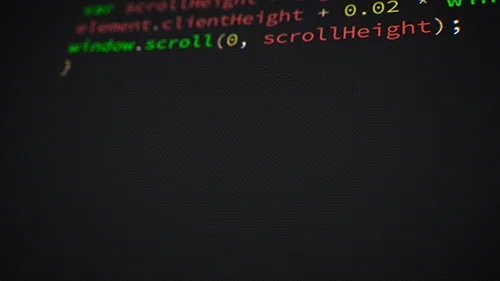

# Hi, I'm Erfan 👋

  

I'm a backend development learner focused on JavaScript and Node.js.

I enjoy understanding the logic behind applications, designing workflows, and exploring how different parts of a backend system work together.

### Currently Learning
- JavaScript and Node.js
- Express.js and REST APIs
- MongoDB and SQL databases
- Git and GitHub

### Interests
- Backend application logic and workflows
- Database design
- Web security

### Projects
- [axios-api-practice](https://github.com/bingoLost/axios-api-practice) — A practice project for learning API requests with Axios.

